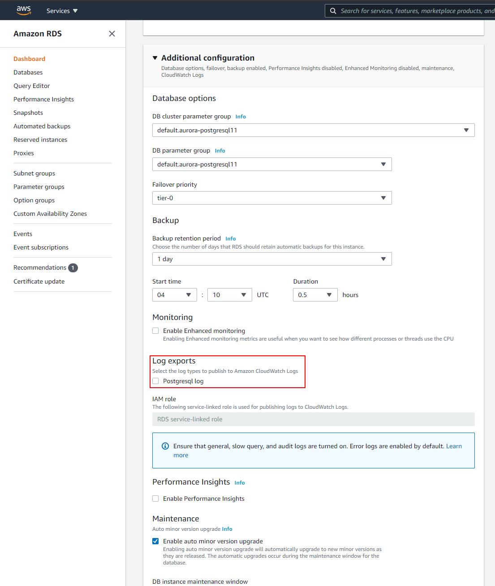
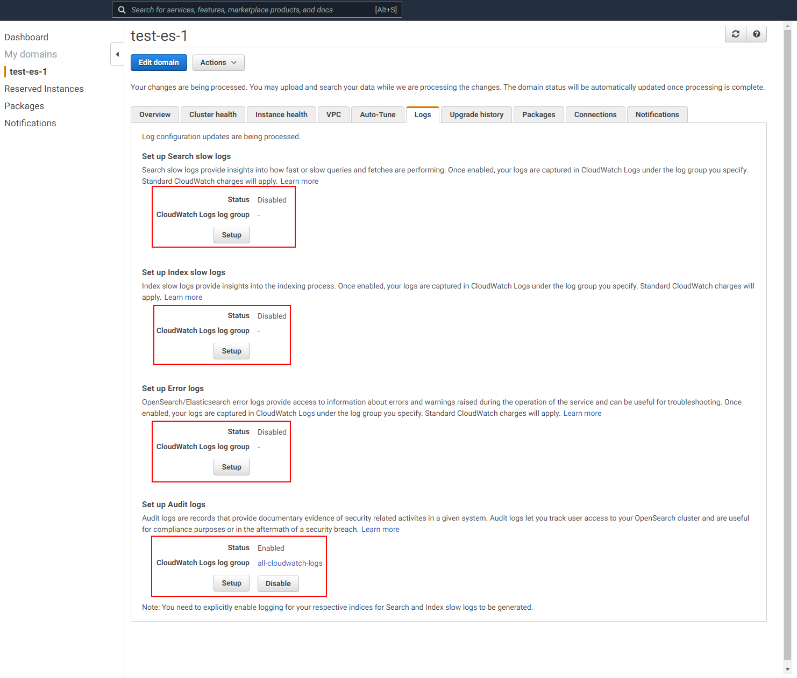
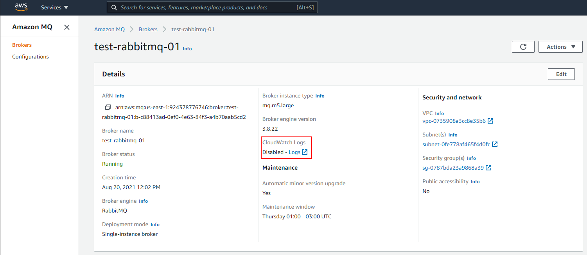
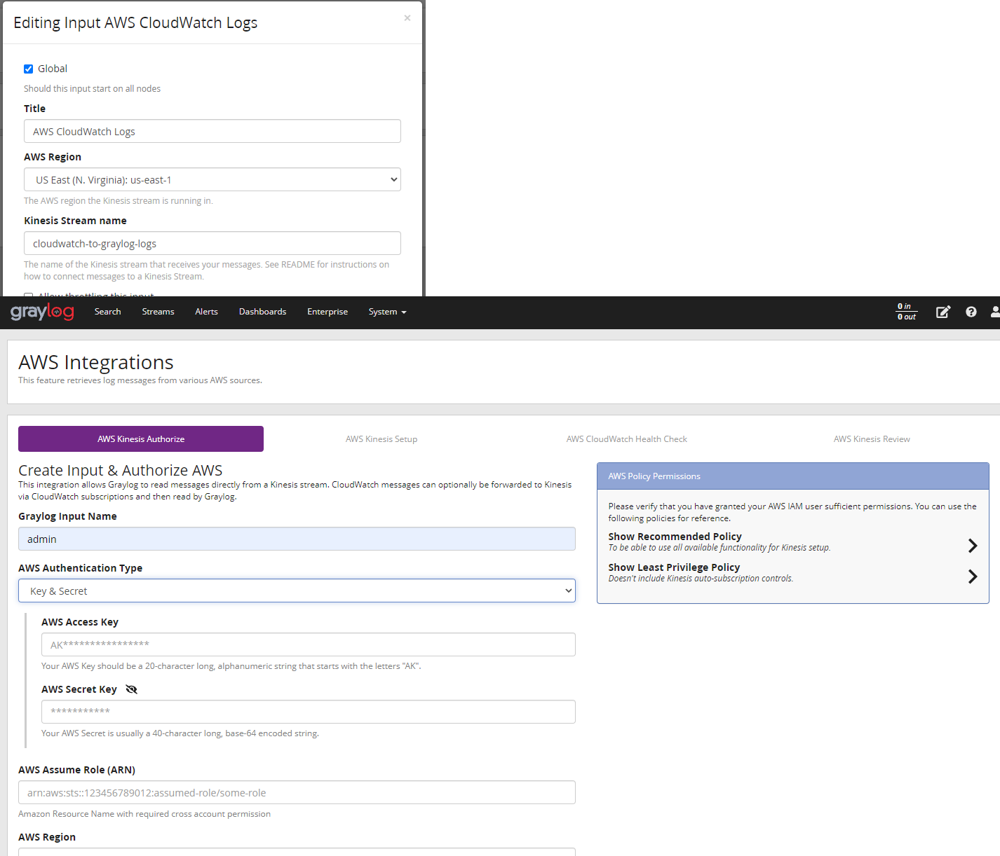

# AWS CloudWatch

This document describes how to integrate Logging agents and Graylog with AWS CloudWatch.

## Table of Content

* [AWS CloudWatch](#aws-cloudwatch)
  * [Table of Content](#table-of-content)
  * [Collect logs and flow logs from AWS Managed Services](#collect-logs-and-flow-logs-from-aws-managed-services)
    * [Preparation](#preparation)
      * [Configure IAM](#configure-iam)
      * [Use Logging integration with VPC](#use-logging-integration-with-vpc)
    * [Configure CloudWatch Log Group](#configure-cloudwatch-log-group)
      * [Configure AWS Services send logs to CloudWatch](#configure-aws-services-send-logs-to-cloudwatch)
        * [Configure AWS Flow Logs](#configure-aws-flow-logs)
      * [Configure AWS EKS (Kubernetes)](#configure-aws-eks-kubernetes)
      * [Configure AWS RDS (PostgreSQL)](#configure-aws-rds-postgresql)
      * [Configure AWS Keyspaces (Cassandra)](#configure-aws-keyspaces-cassandra)
      * [Configure AWS ElasticSearch / OpenSearch](#configure-aws-elasticsearch--opensearch)
      * [Configure AWS MSK (Kafka)](#configure-aws-msk-kafka)
      * [Configure Amazon MQ (Rabbit MQ)](#configure-amazon-mq-rabbit-mq)
    * [Configure AWS Kinesis](#configure-aws-kinesis)
    * [Configure Graylog with AWS Plugin](#configure-graylog-with-aws-plugin)

## Collect logs and flow logs from AWS Managed Services

To collect logs from AWS Managed Service we offer to use the Graylog [AWS Plugin](https://github.com/Graylog2/graylog-plugin-aws)
which can get logs by the following flow:

```yaml
AWS Managed Services -> Write logs -> AWS Kinesis <- Read data from Kinesis <- Graylog with AWS Plugin
```

The configuration of this plugin has a parameter that controls if AWS entity translations are supposed
to be attempted or not. This basically means that the plugin will try to find certain fields like a source IP address
and enrich the log message with more information about the AWS entity (like a EC2 box, an ELB instance,
a RDS database, …) automatically.

### Preparation

This section describes all necessary preparation steps to configure Graylog and it AWS plugin to collect logs
from AWS CloudWatch.

#### Configure IAM

IAM permissions required to use this feature:

```json
{
  "Version": "2012-10-17",
  "Statement": [
    {
      "Sid": "VisualEditor0",
      "Effect": "Allow",
      "Action": [
        "cloudwatch:PutMetricData",
        "dynamodb:CreateTable",
        "dynamodb:DescribeTable",
        "dynamodb:GetItem",
        "dynamodb:PutItem",
        "dynamodb:Scan",
        "dynamodb:UpdateItem",
        "ec2:DescribeInstances",
        "ec2:DescribeNetworkInterfaceAttribute",
        "ec2:DescribeNetworkInterfaces",
        "elasticloadbalancing:DescribeLoadBalancerAttributes",
        "elasticloadbalancing:DescribeLoadBalancers",
        "kinesis:GetRecords",
        "kinesis:GetShardIterator",
        "kinesis:ListShards"
      ],
      "Resource": "*"
    }
  ]
}
```

IAM permissions can be added directly on User or firstly you can create Policies, Groups and then add early
created group to User.

To create User need:

1. Open IAM, select Users
2. Click `Add Users`
3. Enter username and do not forgot set `Access key - Programmatic access` to generate access key
4. Select early created group or permissions
5. Create user and save `Access Key` and `Secret Access Key`

#### Use Logging integration with VPC

**Important!** It is a very important step if you are using VPC. Without VPC Endpoint for CloudWatch it
exported can not get access to it endpoint (non global, non regional).

Read more information about VPC you can in official documentation
[What is Amazon VPC?](https://docs.aws.amazon.com/vpc/latest/userguide/what-is-amazon-vpc.html)

This input uses the AWS SDK to communicate with various AWS resources. Therefore, HTTPS communication
must be permitted between the Graylog server and each of the resources. If communication on the network
segment containing the Graylog cluster is restricted, please make sure that communication to the following
endpoints is explicitly permitted.

```bash
monitoring.<region>.amazonaws.com
cloudtrail.<region>.amazonaws.com
dynamodb.<region>.amazonaws.com
kinesis.<region>.amazonaws.com
logs.<region>.amazonaws.com
```

You need configure VPC Endpoint for CloudWatch if in AWS you are using `Virtual Private Cloud` (VPC).

To add VPC Endpoint need:

1. Use AWS Console and navigate to `VPC`
2. Open `Virtual Private Cloud -> Endpoints`
3. Check column `Service Name`, if `com.amazonaws.<region>.<service>` already exists, you can skip all steps below
4. Click `Create Endpoint`
5. Select:

    ```yaml
    Service category: AWS Services
    Service Name: Find and select com.amazonaws.<region>.<service>
    VPC: Select necessary VPC
    Set another settings
    ```

6. Click `Create Endpoint`
7. Repeat for all necessary services from list above

### Configure CloudWatch Log Group

**Important!** It's a mandatory step which you should execute before configure Amazon Kinesis data stream.

A log group is a group of log streams that share the same retention, monitoring, and access control settings.
You can define log groups and specify which streams to put into each group. There is no limit on the number
of log streams that can belong to one log group.

To create a log group:

1. Open the CloudWatch console at [https://console.aws.amazon.com/cloudwatch/](https://console.aws.amazon.com/cloudwatch/).
2. In the navigation pane, choose Log groups.
3. Choose Actions, and then choose Create log group.
4. Enter a name for the log group, and then choose Create log group.

For example below suppose we create a group called `all-cloudwatch-logs`. In this group we will send all logs
from all AWS Managed Services.

#### Configure AWS Services send logs to CloudWatch

Almost all AWS Managed Services integrated with CloudWatch. But they has a different settings in different places.
This section is intended to describe how to configure CloudWatch logs for the most frequently used services.

##### Configure AWS Flow Logs

**Note:** This step is optional and need only in case when you want to collect `Flow Logs`. Graylog will
collect from another AWS Manager Service without configured `Flow Logs`.

The answer on question "What is Flow Logs?" you can find in official documentation
[VPC Flow Logs](https://docs.aws.amazon.com/vpc/latest/userguide/flow-logs.html).

This step is only needed when setting up the AWS Flow Logs input (skip if setting up the AWS logs input).
There are two ways to enable Flow Logs for an AWS network interface:

* For a specific network interface in your EC2 console, under the `Network Interfaces` main navigation link
  find tab `Flow Logs` and click on `Create Flow Logs` button.
* Or for all network interfaces in your VPC using the VPC console:
  In navigation pane select `Your VPCs`, then find tab `Flow Logs` and click on `Create Flow Logs` button.

After a few minutes (usually 15 minutes but it can take up to an hour), AWS will start writing `Flow Logs`
and you can view them in your CloudWatch console.To find these logs:

1. Open the `Amazon RDS` console at [https://console.aws.amazon.com/cloudwatch](https://console.aws.amazon.com/cloudwatch).
2. In the navigation pane, choose `Log Groups`.
3. Choose the necessary `Log Group` and select `Stream`.
4. Click on stream name and see all raw logs, or specify any filters.

#### Configure AWS EKS (Kubernetes)

For collect metrics from EKS into Kubernetes should install FluentD which deploy as a part of Logging.
So there is no need specific CloudWatch configuration.

**Note:** Logs collection from EKS can work without using Graylog AWS Plugin, because logs are collecting directly
from FluentD.

#### Configure AWS RDS (PostgreSQL)

All information about available logs in CloudWatch you can read in official documentation
[PostgreSQL database log files](https://docs.aws.amazon.com/AmazonRDS/latest/UserGuide/USER_LogAccess.Concepts.PostgreSQL.html).

To publish PostgreSQL logs to CloudWatch Logs using the AWS console:

1. Open the `Amazon RDS` console at [https://console.aws.amazon.com/rds/](https://console.aws.amazon.com/rds).
2. In the navigation pane, choose `Databases`.
3. Choose the DB instance that you want to modify, and then choose `Modify`.
4. In the `Log exports` section, choose the logs that you want to start publishing to CloudWatch Logs.
   The `Log exports` section is available only for PostgreSQL versions that support publishing to CloudWatch Logs.
5. Choose `Continue`, and then choose `Modify DB Instance` on the summary page.

**Note:** Please keep in mind that AWS can change UI and some fields can change names or positions.



_Enable CloudWatch logs for RDS_

#### Configure AWS Keyspaces (Cassandra)

All information about available logs in CloudWatch you can read in official documentation
[Logging Amazon Keyspaces API calls with AWS CloudTrail](https://docs.aws.amazon.com/keyspaces/latest/devguide/logging-using-cloudtrail.html).

Amazon Keyspaces doesn't provide any logs about internal processes and it work. You can configure only
CloudTrail logs, a service that provides a record of actions taken by a user, role, or an AWS service in Amazon Keyspaces.
CloudTrail captures Data Definition Language (DDL) API calls for Amazon Keyspaces as events. The calls that are captured
include calls from the Amazon Keyspaces console and code calls to the Amazon Keyspaces API operations.

#### Configure AWS ElasticSearch / OpenSearch

All information about available logs in CloudWatch you can read in official documentation
[Monitoring OpenSearch logs with Amazon CloudWatch Logs](https://docs.aws.amazon.com/opensearch-service/latest/developerguide/createdomain-configure-slow-logs.html).

To enable log publishing to CloudWatch using the AWS console:

1. Open the `Amazon ElasticSearch` console at [https://console.aws.amazon.com/aos/home](https://console.aws.amazon.com/aos/home).
2. Select the domain you want to update.
3. On the `Logs` tab, select a log type and choose `Setup`.
4. Create a CloudWatch log group, or choose an existing one.
   **Note:** If you plan to enable multiple logs, we recommend publishing each to its own log group.
   This separation makes the logs easier to scan.
5. Choose an access policy that contains the appropriate permissions, or create a policy using the JSON
   that the console provides:

    ```bash
    {
      "Version": "2012-10-17",
      "Statement": [
        {
          "Effect": "Allow",
          "Principal": {
            "Service": "es.amazonaws.com"
          },
          "Action": [
            "logs:PutLogEvents",
            "logs:CreateLogStream"
          ],
          "Resource": "cw_log_group_arn"
        }
      ]
    }
    ```

**Note:** Please keep in mind that AWS can change UI and some fields can change names or positions.



_Logs configuration section for ElasticSeach / OpenSearch_


_Logs configuration dialog for ElasticSeach / OpenSearch_

#### Configure AWS MSK (Kafka)

All information about available logs in CloudWatch you can read in official documentation
[Kafka Logging](https://docs.aws.amazon.com/msk/latest/developerguide/msk-logging.html).

To publish Apache Kafka logs to CloudWatch Logs using the AWS console:

1. Open the `Amazon MSK` console at [https://console.aws.amazon.com/msk](https://console.aws.amazon.com/msk).
2. In the navigation pane, choose `Cluster` then choose the `Details` tab.
3. Scroll down to the `Monitoring` section and then choose its `Edit` button
4. You can specify the destinations to which you want `Amazon MSK` to deliver your broker logs.

**Note:** Please keep in mind that AWS can change UI and some fields can change names or positions.


_Logs configuration section for Apache Kafka_

#### Configure Amazon MQ (Rabbit MQ)

All information about available logs in CloudWatch you can read in official documentation
[Configuring RabbitMQ logs](https://docs.aws.amazon.com/amazon-mq/latest/developer-guide/security-logging-monitoring-rabbitmq.html).

To publish Apache MQ logs to CloudWatch Logs using the AWS console:

1. Open the `Amazon MQ` console at [https://console.aws.amazon.com/amazon-mq](https://console.aws.amazon.com/amazon-mq).
2. In the navigation pane, choose `Brokers` then choose the `Details` tab.
3. In `Details` section find `CloudWatch Logs` and then choose its `Edit` button
4. You can specify the destinations to which you want `Amazon MQ` to deliver your broker logs.

**Note:** Please keep in mind that AWS can change UI and some fields can change names or positions.



_Logs configuration section for RabbitMQ_

### Configure AWS Kinesis

Create a Kinesis stream using the `AWS CLI` tools:

```bash
aws kinesis create-stream --stream-name "cloudwatch-to-graylog-logs" --shard-count 1
```

Now get the Stream details:

```bash
aws kinesis describe-stream --stream-name "cloudwatch-to-graylog-logs"
```

Copy the `StreamARN` from the output. We'll need it later.

Next, create a file called `trust_policy.json` with the following content:

```json
{
  "Statement": {
    "Effect": "Allow",
    "Principal": { "Service": "logs.<region>.amazonaws.com" },
    "Action": "sts:AssumeRole"
  }
}
```

Make sure to change the Service from `<region>` to the Region you are running in.

Now create a a new IAM role with the permissions in the file we just created:

```bash
aws iam create-role --role-name CWLtoKinesisRole --assume-role-policy-document file://trust_policy.json
```

Copy the ARN of the role you just created. You'll need it in the next step.

Create a new file called `permissions.jso`n and set both ARNs to the ARNs your copied above:

```bash
{
  "Statement": [
    {
      "Effect": "Allow",
      "Action": "kinesis:PutRecord",
      "Resource": "[YOUR KINESIS STREAM ARN HERE]"
    },
    {
      "Effect": "Allow",
      "Action": "iam:PassRole",
      "Resource": "[YOUR IAM ARN HERE]"
    }
  ]
}
```

Now attach this role:

```bash
aws iam put-role-policy --role-name CWLtoKinesisRole --policy-name Permissions-Policy-For-CWL --policy-document file://permissions.json
```

The last step is to create the actual subscription that will write the Flow Logs to Kinesis:

```bash
aws logs put-subscription-filter \
    --filter-name "All" \
    --filter-pattern "" \
    --log-group-name "all-cloudwatch-logs" \
    --destination-arn "[YOUR KINESIS STREAM ARN HERE]" \
    --role-arn "[YOUR IAM ARN HERE]"
```

**Important!** You can create some various subscriptions which will send logs from different log groups.

**Important!** You can configure a various filter patterns to send a various logs set into one or
different destinations. For example, you can create one subscription to send all logs (as in example above) and create
subscription to send only audit logs (you need find a common pattern and create filter for them) to another destination.

You should now see Flow Logs being written into your Kinesis stream.

Also state of Kinesis streams you can see in AWS Console:

1. Open the `Amazon Kinesis` console at [https://console.aws.amazon.com/kinesis/home].
2. In the navigation pane, choose `Data Streams` then choose the one of configured streams.
3. In the opened page you can see some parameters of stream configuration and see metrics (In/Out data and so on).

### Configure Graylog with AWS Plugin

**Warning!** AWS Plugin has been deprecated in favor of the new
[AWS Kinesis/CloudWatch](https://go2docs.graylog.org/current/getting_in_log_data/aws_kinesis_cloudwatch_input.html)
input in
[graylog-integrations-plugin](https://github.com/Graylog2/graylog-plugin-integrations).

Now go into the Graylog Web Interface and start a new `AWS Kinesis/CloudWatch` input.
It will ask you for some simple parameters like the Kinesis Stream name you are writing your Flow Logs to.



_Configuration in Graylog AWS plugin_

You should see something like this in your graylog-server log file after starting the input:

```bash
2017-06-03T15:22:43.376Z INFO  [InputStateListener] Input [AWS FlowLogs Input/5932d443bb4feb3768b2fe6f] is now STARTING
2017-06-03T15:22:43.404Z INFO  [FlowLogReader] Starting AWS FlowLog reader.
2017-06-03T15:22:43.404Z INFO  [FlowLogTransport] Starting FlowLogs Kinesis reader thread.
2017-06-03T15:22:43.410Z INFO  [InputStateListener] Input [AWS FlowLogs Input/5932d443bb4feb3768b2fe6f] is now RUNNING
2017-06-03T15:22:43.509Z INFO  [LeaseCoordinator] With failover time 10000 ms and epsilon 25 ms, LeaseCoordinator will renew leases every 3308 ms, takeleases every 20050 ms, process maximum of 2147483647 leases and steal 1 lease(s) at a time.
2017-06-03T15:22:43.510Z INFO  [Worker] Initialization attempt 1
2017-06-03T15:22:43.511Z INFO  [Worker] Initializing LeaseCoordinator
2017-06-03T15:22:44.060Z INFO  [KinesisClientLibLeaseCoordinator] Created new lease table for coordinator with initial read capacity of 10 and write capacity of 10.
2017-06-03T15:22:54.251Z INFO  [Worker] Syncing Kinesis shard info
2017-06-03T15:22:55.077Z INFO  [Worker] Starting LeaseCoordinator
2017-06-03T15:22:55.279Z INFO  [LeaseTaker] Worker graylog-server-master saw 1 total leases, 1 available leases, 1 workers. Target is 1 leases, I have 0 leases, I will take 1 leases
2017-06-03T15:22:55.375Z INFO  [LeaseTaker] Worker graylog-server-master successfully took 1 leases: shardId-000000000000
2017-06-03T15:23:05.178Z INFO  [Worker] Initialization complete. Starting worker loop.
2017-06-03T15:23:05.203Z INFO  [Worker] Created new shardConsumer for : ShardInfo [shardId=shardId-000000000000, concurrencyToken=9f6910f6-4725-3464e7e54251, parentShardIds=[], checkpoint={SequenceNumber: LATEST,SubsequenceNumber: 0}]
2017-06-03T15:23:05.204Z INFO  [BlockOnParentShardTask] No need to block on parents [] of shard shardId-000000000000
2017-06-03T15:23:06.300Z INFO  [KinesisDataFetcher] Initializing shard shardId-000000000000 with LATEST
2017-06-03T15:23:06.719Z INFO  [FlowLogReader] Initializing Kinesis worker.
2017-06-03T15:23:44.277Z INFO  [Worker] Current stream shard assignments: shardId-000000000000
2017-06-03T15:23:44.277Z INFO  [Worker] Sleeping ...
```

It will take a few minutes until the first logs are coming in.

**Important:** AWS delivers Flow Logs intermittently in batches (usually in 5 to 15 minute intervals),
and sometimes out of order. Keep this in mind when searching over messages in a recent time frame.
